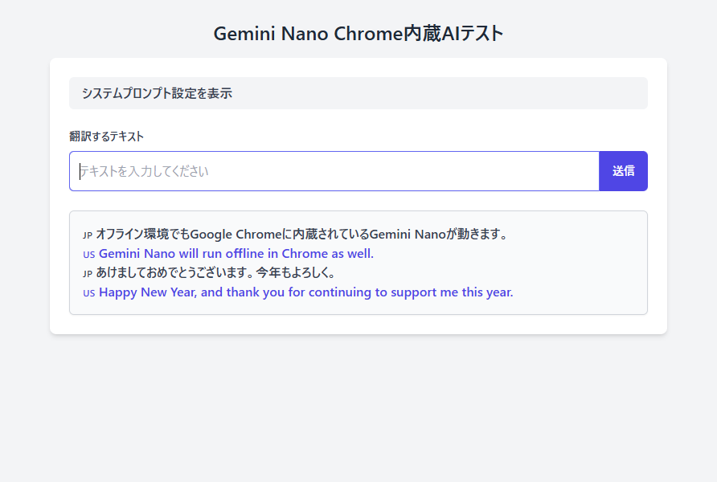

# Chrome 内蔵の Gemini Nano を試してみる

Gemini Nano は Chrome に内蔵された AI で簡易的な AI 機能をオフラインで利用できるので試してみました。

## Gemini Nano を有効化する

Chrome Ver.126 から内蔵されていますが、デフォルトでは無効化されているので有効化する必要があります。

## Experimental flag を変更

[chrome://flags/#optimization-guide-on-device-model](chrome://flags/#optimization-guide-on-device-model)

`Default` から `Enabled BypassPerfRequirement` に変更

[chrome://flags/#prompt-api-for-gemini-nano](chrome://flags/#prompt-api-for-gemini-nano)

`Default` から `Enabled` に変更

## コンポーネントをインストール

[chrome://components](chrome://components)を開いて、 `Optimization Guide On Device Model` をアップデートする。

### Optimization Guide On Device Model が無い場合

F12 を押して開発者ツールを開いて、コンソールに以下のコマンドを入力

```javascript
await ai.languageModel.create();
```

エラーが出て来るけど、これで[コンポーネント](chrome://components)に `Optimization Guide On Device Model` の項目が追加された。

```text
Uncaught InvalidStateError: The session cannot be created.
```

## 翻訳 AI サンプルコード

日本語から英語への翻訳をしながらチャットみたいにログが表示されるサンプルコードを作ってみました。
コピペして HTML ファイルに保存して Chrome で開いたら使えます。もちろんオフライン環境でも。



```html
<!DOCTYPE html>
<html lang="ja">
  <head>
    <meta charset="UTF-8" />
    <meta name="viewport" content="width=device-width, initial-scale=1.0" />
    <title>Translate</title>
    <script src="https://cdn.tailwindcss.com"></script>
  </head>
  <body class="bg-gray-100 min-h-screen flex flex-col items-center py-6">
    <h1 class="text-2xl font-bold text-gray-800 mb-4">
      Gemini Nano Chrome内蔵AIテスト
    </h1>

    <!-- 設定手順エリア -->
    <div id="setupInstructions" class="w-full max-w-3xl mb-6 hidden">
      <div
        class="bg-yellow-100 border-l-4 border-yellow-500 text-yellow-700 p-4 rounded-lg shadow-md"
      >
        <h3 class="font-bold mb-2">
          Gemini Nanoの準備ができていません。以下の手順を実行してください。
        </h3>
        <ul class="list-disc pl-5 space-y-2">
          <li>
            <a
              href="chrome://flags/#optimization-guide-on-device-model"
              target="_blank"
              class="text-blue-600 underline"
              >chrome://flags/#optimization-guide-on-device-model</a
            >
            を開き、<code>Default</code> から
            <code>Enabled BypassPerfRequirement</code> に変更。
          </li>
          <li>
            <a
              href="chrome://flags/#prompt-api-for-gemini-nano"
              target="_blank"
              class="text-blue-600 underline"
              >chrome://flags/#prompt-api-for-gemini-nano</a
            >
            を開き、<code>Default</code> から <code>Enabled</code> に変更。
          </li>
          <li>
            <a
              href="chrome://components"
              target="_blank"
              class="text-blue-600 underline"
              >chrome://components</a
            >
            を開き、<strong>Optimization Guide On Device Model</strong>
            をアップデートする。
          </li>
        </ul>
      </div>
    </div>

    <div class="w-full max-w-3xl bg-white shadow-md rounded-lg p-6">
      <!-- 開閉可能なシステムプロンプト設定 -->
      <div class="mb-6">
        <button
          id="togglePromptButton"
          class="w-full text-left px-4 py-2 bg-gray-100 text-gray-700 font-medium rounded-md hover:bg-gray-200 focus:outline-none focus:ring-2 focus:ring-indigo-500"
        >
          システムプロンプト設定を表示
        </button>
        <div id="systemPromptContainer" class="mt-4 hidden">
          <textarea
            id="systemPrompt"
            class="w-full p-3 border border-gray-300 rounded-md shadow-sm focus:outline-none focus:ring-indigo-500 focus:border-indigo-500"
            rows="4"
          ></textarea>
          <button
            id="updatePromptButton"
            class="mt-3 px-4 py-2 bg-indigo-600 text-white text-sm font-medium rounded-md hover:bg-indigo-700 focus:outline-none focus:ring-2 focus:ring-indigo-500"
          >
            システムプロンプトを更新
          </button>
        </div>
      </div>

      <!-- 入力フィールド -->
      <div class="mb-6">
        <label for="input" class="block text-sm font-medium text-gray-700 mb-2">
          翻訳するテキスト
        </label>
        <div class="flex">
          <input
            type="text"
            id="input"
            placeholder="テキストを入力してください"
            class="flex-grow p-3 border border-gray-300 rounded-l-md shadow-sm focus:outline-none focus:ring-indigo-500 focus:border-indigo-500"
          />
          <button
            id="translateButton"
            class="px-4 py-2 bg-indigo-600 text-white text-sm font-medium rounded-r-md hover:bg-indigo-700 focus:outline-none focus:ring-2 focus:ring-indigo-500"
          >
            送信
          </button>
        </div>
      </div>

      <!-- ログエリア -->
      <div
        id="log"
        class="bg-gray-50 p-4 border border-gray-300 rounded-md shadow-sm overflow-y-auto max-h-96"
      >
        <p id="emptyLogMessage" class="text-sm text-gray-500">
          ここに翻訳結果が表示されます。
        </p>
      </div>
    </div>

    <script>
      let aiSession = null;
      const translationQueue = [];
      let isProcessing = false;

      const defaultSystemPrompt =
        "Translate the following Japanese text into English without adding any explanation or context. Only provide the translated text.";

      async function initializeAI() {
        const systemPrompt = document.getElementById("systemPrompt").value;
        try {
          const capabilities = await window.ai.languageModel.capabilities();
          console.log("Capabilities:", capabilities);

          if (!capabilities.available) {
            displaySetupInstructions();
            return;
          }

          aiSession = await window.ai.languageModel.create({
            systemPrompt,
          });
        } catch (error) {
          console.error("AI Initialization Error:", error);
          displaySetupInstructions();
        }
      }

      function displaySetupInstructions() {
        const setupInstructions = document.getElementById("setupInstructions");
        setupInstructions.classList.remove("hidden");
      }

      function updateSystemPrompt() {
        aiSession = null;
        initializeAI();
        alert("システムプロンプトを更新しました。");
      }

      function toggleSystemPrompt() {
        const container = document.getElementById("systemPromptContainer");
        const button = document.getElementById("togglePromptButton");

        if (container.classList.contains("hidden")) {
          container.classList.remove("hidden");
          button.textContent = "システムプロンプト設定を隠す";
        } else {
          container.classList.add("hidden");
          button.textContent = "システムプロンプト設定を表示";
        }
      }

      function toggleEmptyLogMessage() {
        const log = document.getElementById("log");
        const emptyLogMessage = document.getElementById("emptyLogMessage");

        if (log.children.length > 1) {
          emptyLogMessage.style.display = "none";
        } else {
          emptyLogMessage.style.display = "block";
        }
      }

      function queueTranslation(inputText) {
        const log = document.getElementById("log");
        const logEntry = document.createElement("div");
        logEntry.innerHTML = `
        <p class="font-medium text-gray-700">🇯🇵 ${inputText}</p>
        <p class="italic text-gray-500">🇺🇸 Translating...</p>
      `;
        log.prepend(logEntry);

        toggleEmptyLogMessage();

        translationQueue.push({ inputText, logEntry });
        processQueue();
      }

      async function processQueue() {
        if (isProcessing || translationQueue.length === 0) return;

        isProcessing = true;
        const { inputText, logEntry } = translationQueue.shift();

        try {
          const result = await aiSession.prompt(inputText);
          logEntry.innerHTML = `
          <p class="font-medium text-gray-700">🇯🇵 ${inputText}</p>
          <p class="font-medium text-indigo-600">🇺🇸 ${result}</p>
        `;
        } catch (error) {
          console.error("Translation Error:", error);
          logEntry.innerHTML = `
          <p class="font-medium text-gray-700">🇯🇵 ${inputText}</p>
          <p class="text-red-600">Error: ${error.message}</p>
        `;
        } finally {
          isProcessing = false;
          processQueue();
        }
      }

      document.addEventListener("DOMContentLoaded", () => {
        document.getElementById("systemPrompt").value = defaultSystemPrompt;
        initializeAI();

        document
          .getElementById("updatePromptButton")
          .addEventListener("click", updateSystemPrompt);
        document
          .getElementById("togglePromptButton")
          .addEventListener("click", toggleSystemPrompt);

        document
          .getElementById("translateButton")
          .addEventListener("click", () => {
            const input = document.getElementById("input").value.trim();
            if (input) {
              queueTranslation(input);
              document.getElementById("input").value = "";
            }
          });

        document
          .getElementById("input")
          .addEventListener("keydown", (event) => {
            if (event.key === "Enter") {
              const input = document.getElementById("input").value.trim();
              if (input) {
                queueTranslation(input);
                document.getElementById("input").value = "";
              }
            }
          });

        toggleEmptyLogMessage();
      });
    </script>
  </body>
</html>
```
